<!-- Force Jekyll to render correctly -->
<!-- Responsive-friendly README -->
# *PROJETS*

# Projet : Excel & VBA Application (Gestion de caisse d'un supermarché)

Application Excel VBA pour gérer les recettes de caisse, détecter les écarts, suivre les titres restaurant, automatiser les rapports et réaliser le rapprochement bancaire. Formulaires, macros, calculs automatiques et tableau de bord intégré.

---

## Objectifs du projet

- Centraliser les données de caisse en un seul endroit.
- Automatiser les tâches manuelles (calculs, rapports, alertes).
- Suivre en détail les titres restaurant par émetteur.
- Détecter automatiquement les écarts de caisse.
- Structurer la traçabilité des justificatifs.
- Faciliter le rapprochement bancaire mensuel.
- Améliorer la fiabilité et la transparence du processus de caisse.

---

## Fonctionnalités principales

---

### 1. Dashboard interactif

- Accueil central de l’application.
- Raccourcis vers les formulaires de Saisie, Recherche, Titres Restaurant, Écarts Caisse.
- Indicateurs clés : TR reçus/versés, écarts, chèques, virements.
- Vue synthétique des performances.

  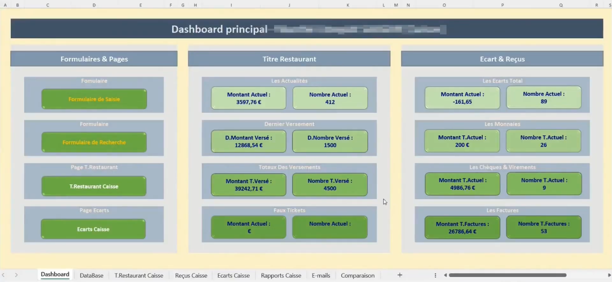

---

### 2. Base de données des recettes (Database)

- Enregistrement structuré et horodaté des recettes journalières.
- Montants par mode de paiement : espèces, CB, titres restaurant, etc.
- Suivi des écarts et commentaires de caisse.
- Fonctionne comme une base SQL simplifiée.

  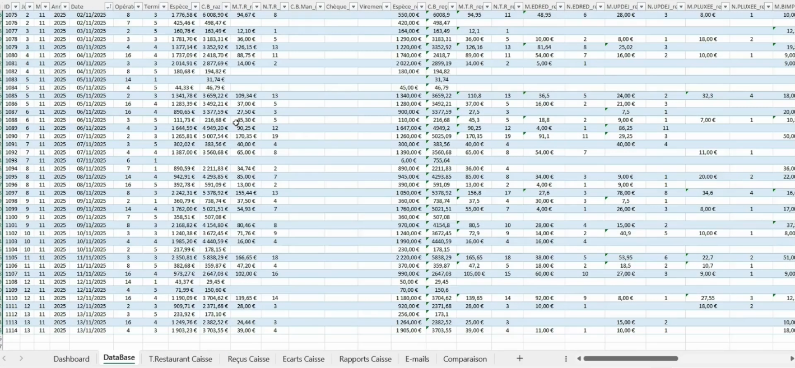

---

### 3. Titres Restaurant – par émetteur

- Suivi détaillé par prestataire : BIMPLI, Edenred, UP Déjeuner, Pluxee.
- Montants collectés, versements, totaux par période.
- Indicateurs pour prévenir les écarts TR.

  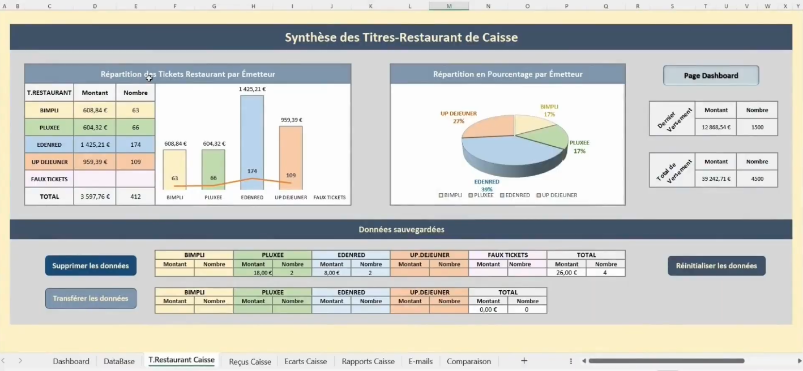

---

### 4. Reçus Caisse

- Gestion des justificatifs : monnaie, virements, chèques, factures.
- Suivi des entrées et sorties non liées aux encaissements.
- Traçabilité complète.

  

---

### 5. Écarts de caisse

- Analyse automatique des écarts entre encaissé et versé.
- Alertes en cas d’incohérences.
- Identification des anomalies : jour, terminal, opérateur.

  

---

### 6. Rapports de caisse

- Synthèse automatisée :
  - Écarts non justifiés  
  - Justificatifs manquants  
- Export comptable.
- Aide aux audits internes et externes.

  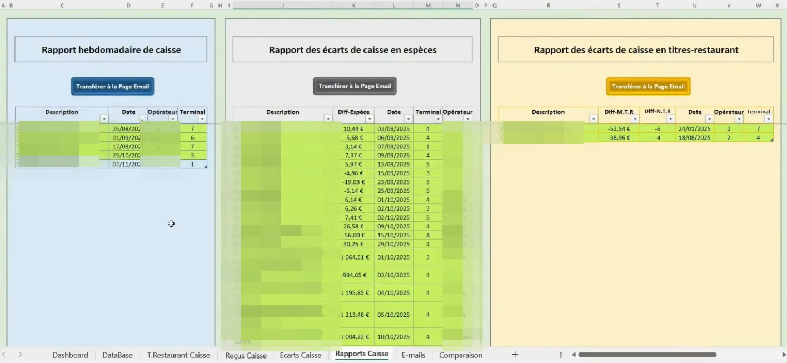

---

### 7. E-mails automatisés

- Envoi automatique aux responsables.
- Alertes sur écarts importants et justificatifs manquants.
- Amélioration du suivi opérationnel.

  

---

### 8. Comparaison & rapprochement bancaire

- Comparaison Recettes Caisse vs Comptabilité/Banque.
- Détection des écarts mensuels.
- Fiabilisation comptable.

  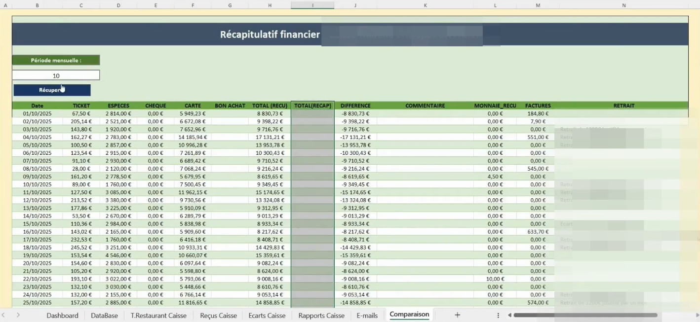

---

## Stack Technique

**Technologies utilisées :**
- Excel (.xlsm)
- VBA – Visual Basic for Applications

**Compétences démontrées :**
- UserForms personnalisés  
- Gestion des événements  
- Modules VBA modulaires  
- Traitement dynamique des données  
- Vérification d’intégrité  
- Automatisation des exports & rapports  
- Interface utilisateur Excel  
- Architecture multi-feuilles  

---

## Architecture du projet

  

Chaque feuille assure un rôle métier dédié, et le VBA garantit l’automatisation et la cohérence globale.

---

## Ce que ce projet démontre

✔ Automatisation avancée dans Excel  
✔ Développement VBA structuré  
✔ Mini système d'information interne  
✔ Fiabilisation d’un processus métier  
✔ Compréhension du flux financier d’un magasin  
✔ Automatisation d’un processus manuel  

---

> **Vous trouverez le détail du projet sur GitHub ici :**
> [Lien vers le projet](https://github.com/users/AtefBELKHIRIA/projects/6/views/1)

> **Vous pouvez visionner le projet en vidéo ici :** 
> [Lien vers la vidéo](https://www.canva.com/design/DAG6Xr5cqsk/YXBdGxns0ZAj63TosDjPVA/watch?utm_content=DAG6Xr5cqsk&utm_campaign=designshare&utm_medium=link2&utm_source=uniquelinks&utlId=h78948ab92a)

---

# Projet : Rapport Power BI - Analyse des Joueurs, Cadres et Clubs de Hockey (Île-de-France)

Ce projet Power BI a été conçu pour la Ligue régionale de hockey sur glace d’Île-de-France afin d’assurer un suivi avancé de l’évolution des joueurs, des cadres, et des clubs sur plusieurs saisons.
Il met en œuvre différentes techniques de modélisation, visualisation et analyse pour offrir un tableau de bord complet, dynamique et exploitable par les instances sportives.

---

## Approche technique

---

###  Modélisation des données

- Construction d’un modèle en étoile optimisé, comprenant :
  - des tables de faits : effectifs, licences, mouvements interclubs
  - des tables de dimensions : clubs, catégories, saisons, joueurs
- Normalisation et création de relations un-à-plusieurs pour une navigation cohérente entre les différentes analyses.
- Mise en place de colonnes calculées pour :
  - identifier les nouveaux joueurs
  - détecter les mouvements (sortants/entrants)
  - catégoriser les licences (mineurs, adultes, catégories U)

---

###  Mesures DAX clés

Création de mesures DAX permettant des analyses temporelles fiables :
- Nb Joueurs, Nb Cadres, Nb Clubs Actifs
- Taux de fidélisation
- Joueurs sortants / entrants / restants
- Variation inter-saison
- Calculs dynamiques basés sur le contexte filtré (club, saison, catégorie)
Ces mesures sont pensées pour garantir :
- une performance optimale,
- des résultats cohérents lors du filtrage croisé,
- une flexibilité pour de futures évolutions du modèle.

---
## Fonctionnalités principales

---

### 1. Analyse multi-niveaux des effectifs

Le rapport permet une lecture détaillée du joueur à la ligue, en passant par le club, grâce à :
  - des segments dynamiques (club, saison, catégorie)
  - des analyses croisées
  - une navigation fluide entre pages

  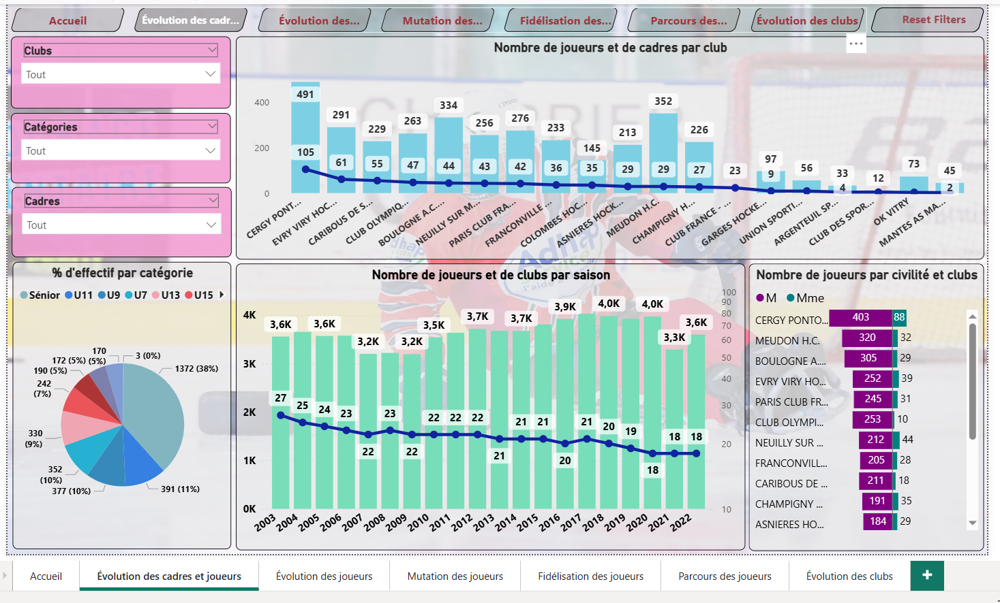

Compréhension fine de la structure des effectifs et identification des tendances par population.

---

### 2. Suivi de l’évolution sur plusieurs saisons

Plusieurs visualisations permettent d’observer l’évolution :
  - du nombre de joueurs par saison
  - des catégories d’âge
  - des premières licences
  - des cadres

  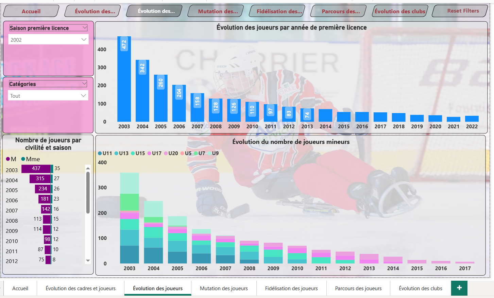

Evaluer la progression ou la stagnation des clubs et des effectifs.

---

### 3. Analyse complète de la mobilité

Une section spécialement dédiée met en avant :
  - le pourcentage de joueurs quittant la région
  - les flux entrants et sortants entre clubs
  - des filtres « Club d’origine » / « Club destinataire »

  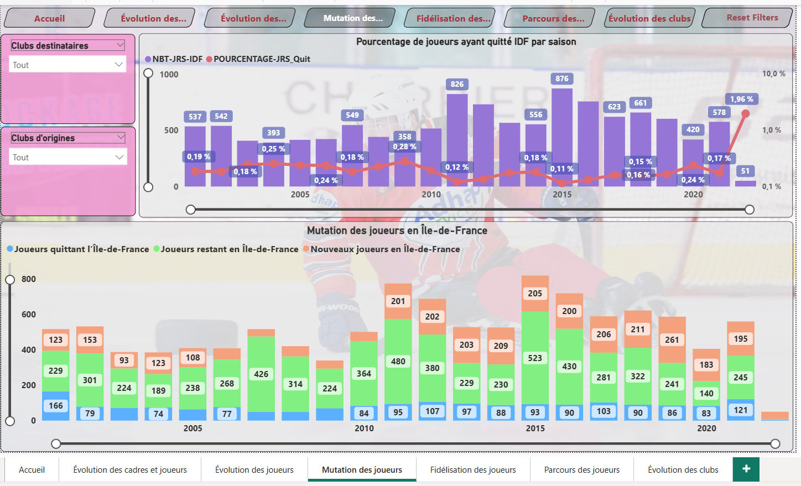

Visibilité précise sur les mouvements internes, utile pour la stratégie de développement.

---

### 4. Mesure du taux de fidélisation

Le rapport calcule automatiquement :
  - la part de joueurs restants d’une saison à l’autre
  - les nouveaux inscrits
  - les départs

  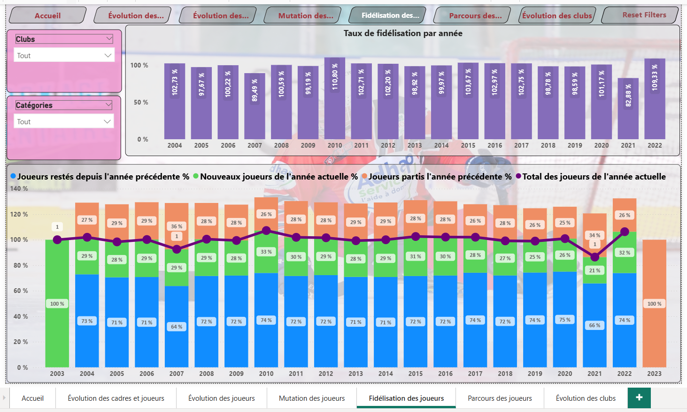

Indicateur essentiel pour mesurer la stabilité des clubs et orienter les actions de fidélisation.

---

### 5. Suivi individuel des joueurs

Grâce à une recherche par :
  - code adhérent
  - nom / prénom
  - année de naissance
Le rapport affiche l’ensemble du parcours d’un joueur : clubs, saisons, catégories, mouvement éventuels.

  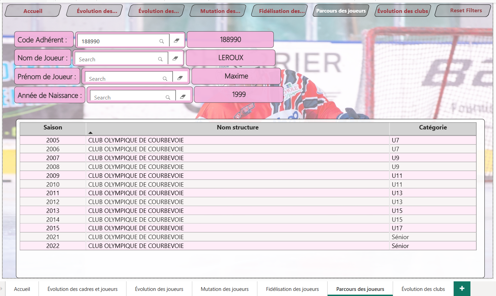

Outil administratif robuste pour les dirigeants et responsables de la ligue.

---

### 6. Analyse de la stabilité des clubs

Un volet complet dédié aux clubs permet :
  - de visualiser les clubs actifs par saison
  - d’identifier les entrées/sorties
  - de suivre l’évolution structurelle de la ligue

  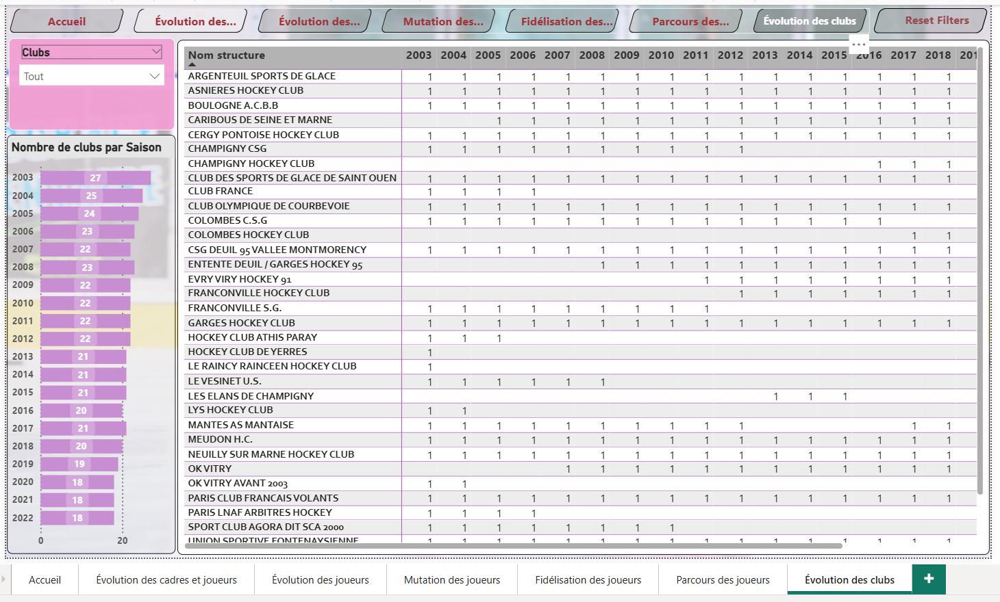

Compréhension de la dynamique régionale et détection des zones à renforcer.

---

## Publication & Déploiement sur Power BI Service

L’un des aspects essentiels de ce projet a été la mise en place d’un processus complet de **publication, maintenance et consultation cloud** via Power BI Service.
Ce déploiement permet de rendre le rapport accessible en ligne, sécurisé et utilisable aussi bien sur ordinateur que sur smartphone.

---

### Valeur ajoutée
- **Accessibilité 24/7** du rapport via le cloud.  
- **Synchronisation automatique** entre la version Desktop et la version en ligne.  
- Consultation fluide sur **application mobile Power BI (iOS/Android)** grâce à la mise en page mobile.  
- Possibilité d’intégration dans un site interne ou via un lien sécurisé.  
- Sécurité renforcée grâce à la gestion des rôles et des permissions.

---
### L'accès mobile via Power BI Service
Les utilisateurs peuvent accéder au tableau de bord :
- depuis l’app Power BI
- depuis app.powerbi.com sur navigateur mobile
- ou via un lien partagé sécurisé

---
**Voici quelques aperçus :** Page d'accueil, Evolution des Cadres & Joueurs et Page Parcours des Joueurs

  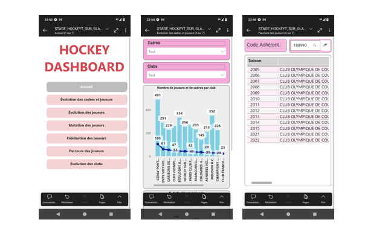

---
## Stack technique
---

###  Technologies utilisées

  - **Power BI Desktop**
  - **DAX** (mesures, colonnes calculées)
  - **Power Query** (nettoyage & transformations)
  - **Modélisation en étoile** (faits / dimensions)
  - Visualisations Power BI : tornades, matrices, KPI, histogrammes empilés, graphiques combinés

###  Compétences démontrées

  - Modélisation de données et optimisation des relations
  - Création de mesures DAX avancées (fidélisation, mobilité, évolutions temporelles)
  - Analyse statistique et segmentation des joueurs
  - Construction d’analyses multi-saisons
  - Data storytelling : structuration du rapport, navigation, filtres intelligents
  - UX/UI pour tableaux de bord interactifs

---

> **Vous trouverez le détail du projet sur GitHub ici :**
> [Lien vers le projet](https://github.com/users/AtefBELKHIRIA/projects/4/views/1)

> **Vous pouvez visionner le projet en vidéo ici :**
> [Lien vers la vidéo](https://www.canva.com/design/DAG6Xo_BRtw/YS8Ic3MUTO7FK9zMdrj31A/watch?utm_content=DAG6Xo_BRtw&utm_campaign=designshare&utm_medium=link2&utm_source=uniquelinks&utlId=h98485160fe)

---

# *CERTIFICATIONS*

## Certificat : Associé Analyste de données - Microsoft Power BI
---
### Compétences mesurées
- Préparer les données
- Modéliser les données
- Visualiser et analyser les données
- Gérer et sécuriser Power BI

  

> Vous pouvez consulter le certificat ici : 
> [Lien officiel](https://learn.microsoft.com/fr-fr/users/atefbelkhiria-0434/credentials/7b8fb60f6b321bf3)

> _“Les données racontent toujours une histoire — il suffit de savoir comment les écouter.”_
