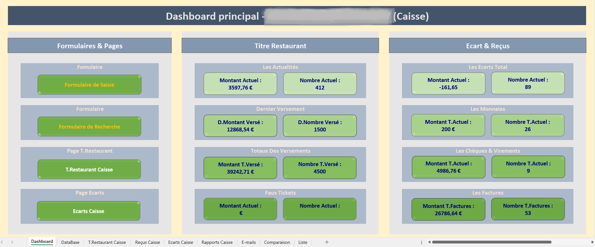
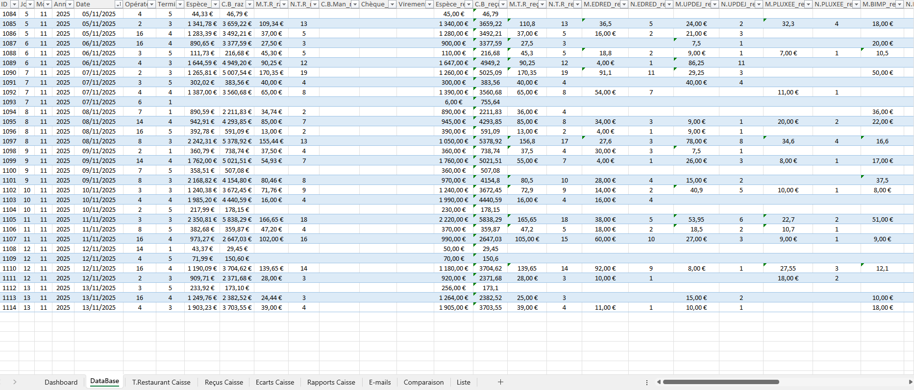
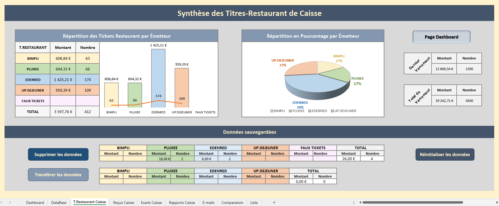
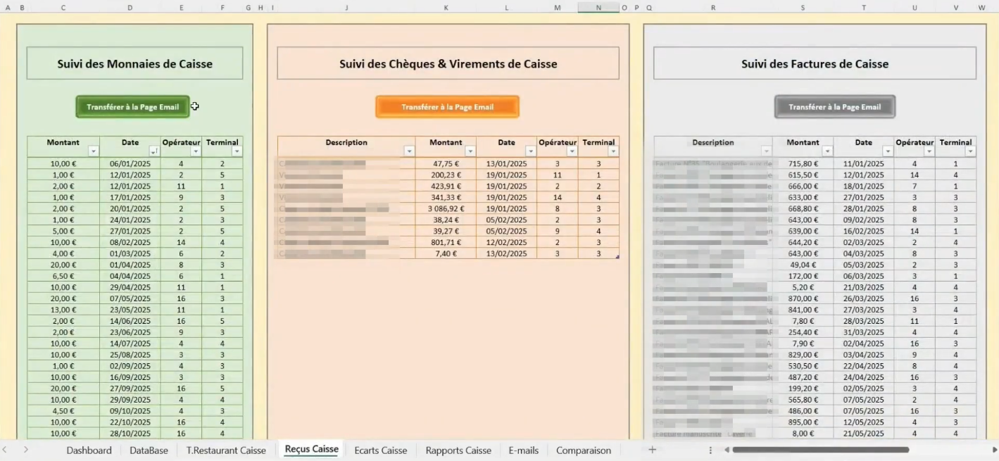
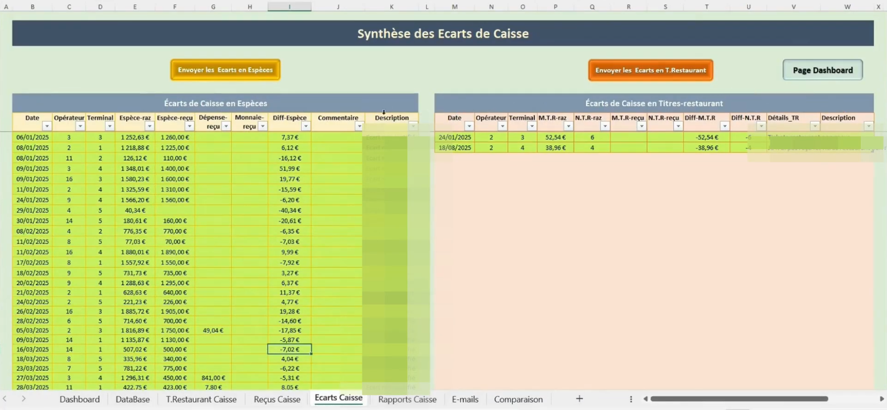
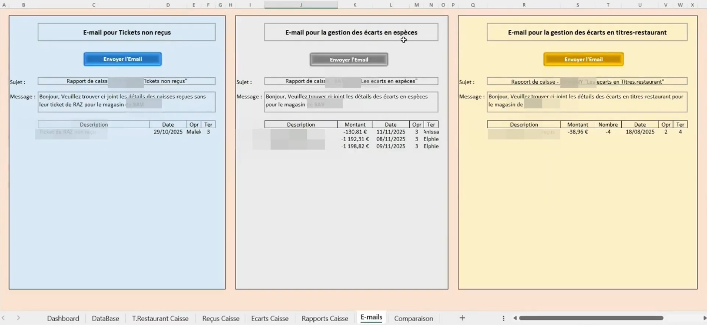
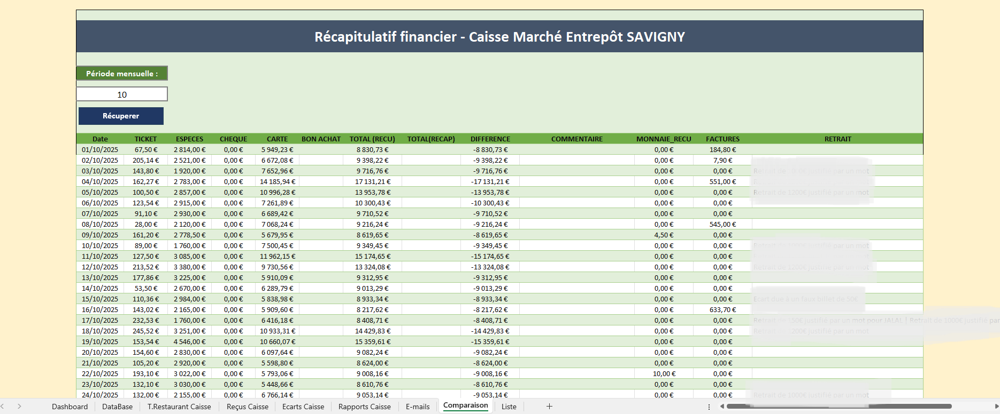
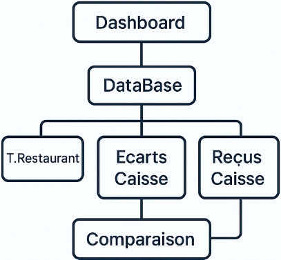

# Projet : Excel & VBA Application (Gestion de caisse d'un supermarché)

Application Excel VBA pour gérer les recettes de caisse, détecter les écarts, suivre les titres restaurant, automatiser les rapports et réaliser le rapprochement bancaire. Formulaires, macros, calculs automatiques et tableau de bord intégré.

---

## Objectifs du projet

- Centraliser les données de caisse en un seul endroit.

- Automatiser les tâches manuelles (calculs, rapports, alertes).

- Suivre en détail les titres restaurant par émetteur.

- Détecter automatiquement les écarts de caisse.

- Structurer la traçabilité des justificatifs.

- Faciliter le rapprochement bancaire mensuel.

* Améliorer la fiabilité et la transparence du processus de caisse.

---

### Fonctionnalités principales

#### 1. Dashboard interactif

- Accueil central de l’application.

- Raccourcis vers les formulaires de Saisie, Recherche, Titres Restaurant, Écarts Caisse.

- Indicateurs clés :

  - Montants titres restaurant reçus et versés

  - Écarts de caisse constatés

  - Montants encaissés par chèque et par virement

- Vue synthétique des performances du jour / de la période.

###  2. Base de données des recettes (Database)

- Enregistrement structuré et horodaté des recettes journalières.
- Montants par mode de paiement : espèces, CB, titres restaurant, etc.
- Suivi des écarts et commentaires de caisse.
- Fonctionne comme une base SQL simplifiée au sein d’Excel.

 

###  3. Titres Restaurant – par émetteur

- Suivi détaillé par prestataire : BIMPLI, Edenred, UP Déjeuner, Pluxee.
- Montants collectés, versements réalisés, totaux par période.
- Indicateurs de suivi pour éviter les écarts titres restaurant.

 

###  4. Reçus Caisse

- Gestion des justificatifs : monnaie, virements, chèques, factures.
- Suivi des entrées et sorties autres que les encaissements.
- Traçabilité complète au quotidien.

###  5. Écarts de caisse
 
- Analyse automatique des écarts : 
    - Entre montants encaissés et montants versés (espèces / Titre Restaurant). 
- Alerte sur incohérences.
- Identification rapide des anomalies par jour, opérateur ou terminal.

###  6. Rapports de caisse

- Synthèse automatisée des :
   - Écarts non justifiés
   - Justificatifs manquants
- Données prêtes à l’export (comptabilité, direction).
- Simplifie les audits internes et externes.

###  7. E-mails automatisés

- Module VBA d’envoi automatique d’emails aux responsables. 
- Alertes sur écarts significatifs ou justificatifs non transmis.
- Améliore la réactivité et le suivi qualité.

###  8. Comparaison et rapprochement bancaire

- Comparaison entre :
  - Total Recettes Caisse
  - Totaux Comptabilité / Banque 
- Détection des différences mensuelles.
- Fiabilisation du processus comptable.

---

##  Stack Technique

 **Technologies utilisées**
   - Excel (macro-enabled .xlsm)
   - VBA – Visual Basic for Applications

 **Compétences techniques démontrées**
   > Développement d’UserForms personnalisés
> Gestion des événements (click, change, validate)
> Création de modules VBA modulaires
> Traitement dynamique des données (boucles, filtres, tris)
> Validation et contrôle d’intégrité
> Automatisation des exports et rapports
> Conception d’interface utilisateur dans Excel
> Structuration d’un fichier Excel multi-feuilles orienté application 

---

##  Architecture du projet

Chaque feuille remplit un rôle métier précis, et le code VBA assure la liaison, l’automatisation et la cohérence des données entre elles.

---

##  Ce que ce projet démontre

  ✔ Automatisation avancée dans Excel
  ✔ Développement VBA structuré
  ✔ Mise en place d’un mini système d'information interne
  ✔ Sécurisation et fiabilisation d’un processus métier réel
  ✔ Compréhension des flux financiers en magasin
  ✔ Capacité à transformer un processus manuel → solution automatisée

---

> _“Les données racontent toujours une histoire — il suffit de savoir comment les écouter.”_  

